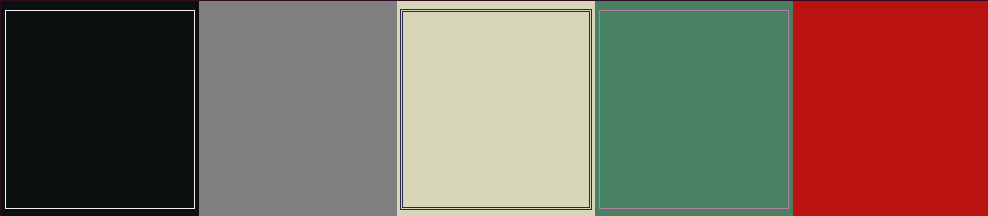
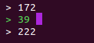
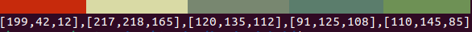

# vivid
A golang bubbletea TUI wrapping around the [Colormind API](http://colormind.io/)

## Features
Provides all the same features as the original website, and more!:
- Generate a unique color scheme
- Lock colors to prevent them from changing when you generate more
- Move colors around
- Change each color's individual RGB values
- Output the RGB values for each color
- Select a custom style (UI, Fauvism, etc.)
- Scales to any terminal size

## Visuals

### Select a model
Menu:

### Scaling
Small:

Big:

### Locking
The lines signify being selected or locked.

### Edit Colors
Color editing menu:

### Exporting:
Exporting looks like:

## Controls

Quit - CTRL+C, Q, or ESC
Navigate selection/editing menu - W, Up Arrow, S, Down Arrow
Select option while in menu - Enter 
Reopen model selection - M
Toggle editing for selected color - E
Finish editing current color - Enter
Lock current selected color - Enter or Space
Move selected color - A, Left Arrow, D, Right Arrow
Swap selected color with color next to it - <, Comma, >, Period
Load new colors from API - R